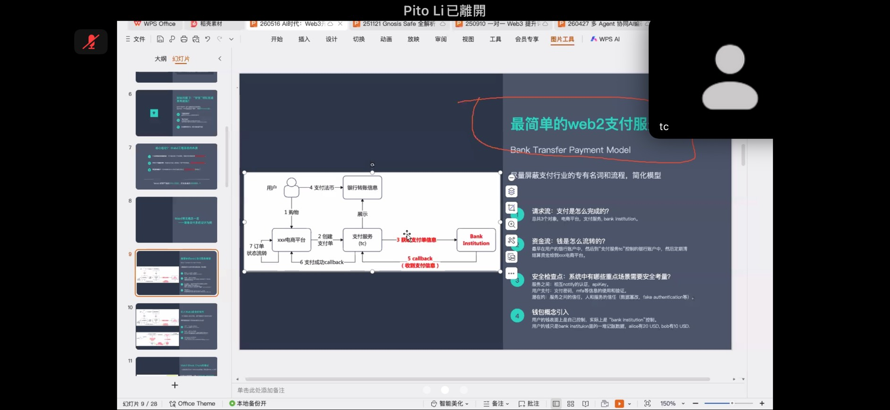
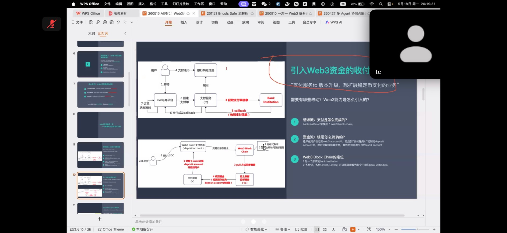
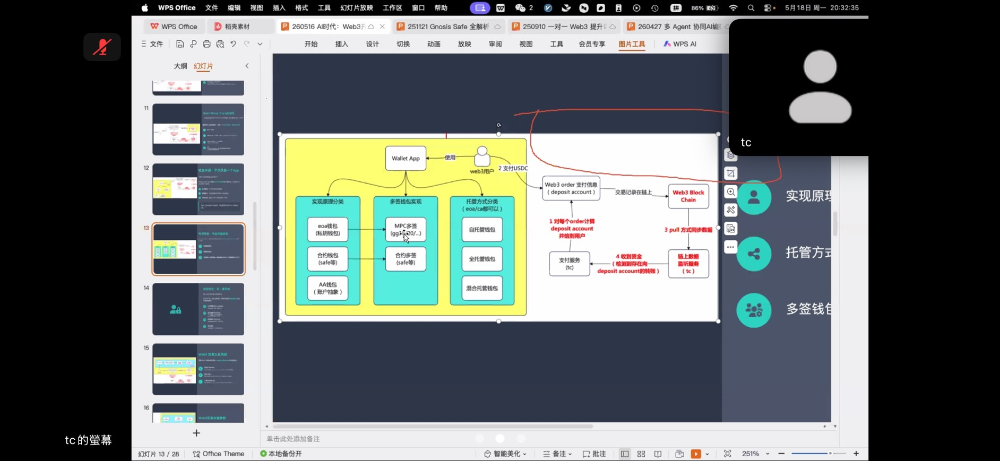
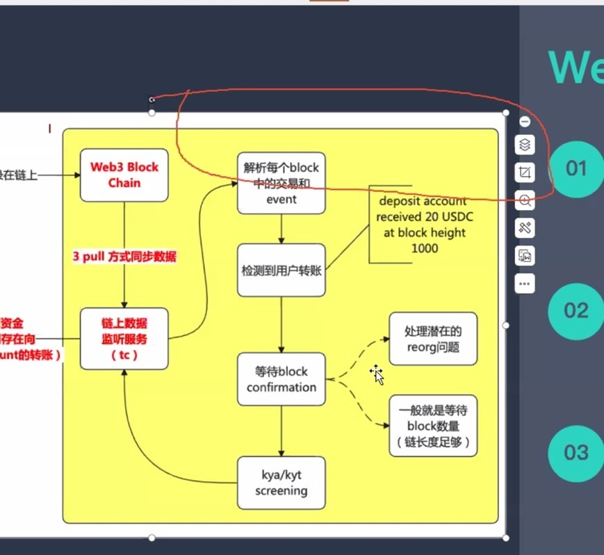

## [分享會] AI時代，Web3開發者所需的能力

### 引言：
Q1: 有了AI，是否還要學習基礎知識？
A: Of course, 有了AI，分析人與AI的專業邊界，人：設計方案，AI：協助人設計方案（細化方案、補足缺失、有效快速的方案執行），人應作為AI的審查者（AI並未降低複雜度）。

Q2: Web2 vs. Web3?
A: 沒有前端頁面、沒有好的後端管理服務，用戶是無法使用web3的，在web3的產品中，web2的佔比還是很大的，兩者並非互斥。

Q3: Web3上的安全
A: 在Web3內，涉及許多資金的交互，「安全」不是一個隨時加入的插件，而是設計的核心屬性。

### 以支付系統作為例子：
1. In Web2: ex. Bank Transfer
各種請求流的服務之間API交互：
- 請求流
- 資金流
- 安全檢查：KYC、服務之間的信任、密碼Permissions

信任=>信任Institutional Backend

2. In Web3: 擴展至穩定幣支付時
=> 抽象來看 將Bank Institution -replaced by-> Blockchain
=> Different Chain ~= Different Banks

信任=>Transparency、Immutability、共識機制(PoW, PoS)、私鑰簽名

### 錢包：
1. Def:
* 錢包在Web3中扮演的是用戶的「身份」及「資產管理」=> 證明用戶行為的證明
* 私鑰就是一串大數，透過數學的算法保證
* message -input-> private key -output-> signature

2. Category
* EOA: Public+PrivateKey --> MCP 多簽
* Smart Contract Wallet: ex. Safe (for Multi-sig)
* AA: Combine EOA + Smart Account
* 託管方式：自託管、全託管ex.Exchanger、Hybrid

3. 錢包安全防線：
1. PrivateKey Leak
2. 簽名欺騙：eth_sign禁用、簽名可視性低
3. 權限濫用

#### Web3交易週期：構造->簽名->廣播
＊交易的關鍵參數：
1. **gas**: 交易手續費（影響）
   gas fee = gas count * gas price
2. EIP-1559
3. **nonce**: 確保交易冪等
   ETH => Account模型，default nonce排序
   Tron/Solana => X nonce, sdk使用交易Hash確保
   BTC => UTXO模型，cash只能用一次，原生冪等
4. Calldata: 鏈上交易的靈魂，可理解為interpreter，執行端會自行解析交易data

#### 交易模擬(Simulate)：
1. 在提交交易前驗證執行結果
2. *必須在簽名前進行模擬*

#### Web3 Server端的錢包安全
1. 資金量拆分，減少單點風險
2. 私鑰保護 ex. TEE可信任空間，無任何暴露
*安全屬於Web3的核心要素*

#### AI 的變與不變
Change:
1. Coding更快 放大了個人的能力

Unchange:
1. 系統的複雜度
2. 錯誤成本: 人應確保AI安全是可控的
3. 安全邊界
=> 駕馭AI，而不是被AI驅動